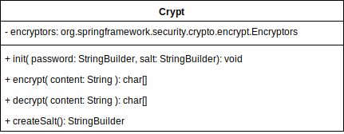

## 任务
### 目标
对用户的私密日记进行加密，并在用户输入密码后解密相关内容
### 项目背景
解决用户需要安全保存隐私内容的需求
### 需求
对用户的私密日记进行加密与解密，验证方式为手势密码或数字密码。
用户在设定密码时允许设置密码提示词，但提示词不能与密码相同。
用户忘记密码时不能找回密码，只能通过密码提示词想起密码内容；
若不能想起密码，则已加密的日记无法被解密，但新日记可以使用新密码加密/解密。  
### 局限
- 不负责日记的同步
- 不负责密钥的保存
- 不负责存储

### 定义

## 总体设计
### 处理流程

### 总体结构与模块

## 接口设计

### 异常处理
无

