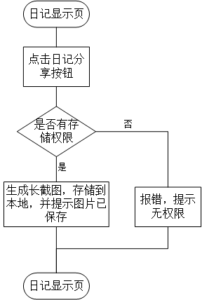

概要设计说明书
====
## 引言：
>编写目的：
本阶段是在系统的需求分析的基础上，对电子日记本系统做的概要分析。主要解决实现该系统需求的模块设计额外难题，包括把该系统划分为哪些模块，决定各个模块之间的接口，模块之间传递的信息等

>在下一阶段的详细设计中，设计人员可参考此概要设计说明书，在概要设计对电子日记本系统所做的模块结构的基础上，对系统进行详细设计，在以后的软件测试以及软件维护阶段也可参考此说明书，以便了解在概要设计过程中完成的各个模块设计结构，或在修改时找出在本阶段设计的不足和错误

1.2项目背景

1.3 定义

1.3.1专业术语

1.4参考资料

1.5

二、总体设计

2.1 需求规定

2.1.1 系统功能

本系统主要包括以下几个方面的功能：

>将日记生成长截图保存到本地，方便用户调动系统分享图片的方式分享

系统性能
>可靠性：在常规情况下，不能出现日记内容拼接错误，或分辨率不够的情况

输入输出要求
>输出一张照片

数据管理能力要求：

故障处理要求

运行环境：
>2.2.1 设备：

>Android 6.0 以上的智能手机

接口
>本模块提供用日记的分享接口

基本设计概念和处理流程

各个模块的说明如下：
>本模块没有子模块

三．接口设计

3.1 人机交互接口
>用户在日记显示界面点击分享按钮，生成图片保存到图库。

3.2 网络接口

>需要其他系统提供网络状态检查接口。

3.3 系统和外部接口

3.4 系统内模块之间接口
>本模块为系统提供图片分享接口

3.5 数据库接口

四．系统数据结构设计

4.1 逻辑结构设计要点

数据库的结构见下表：

五．系统出错处理设计

5.1 出错信息

>当出现没有保存权限时，提示用户给予文件存储权限。

>当出现系统级错误时，采取的处理方式为向用户返回错误信息，具体为：“对不起，无法生成照片！”

5.2 补救措施

>数据库的备份采取每段时间进行一次完全备份，并采取带日志运行的方式当出现数据库级的错误时，采取的方式分为两种：

>用数据库的完全备份实现数据库的完全恢复

>用数据库的完全备份和日志文件实现数据库的不完全恢复
