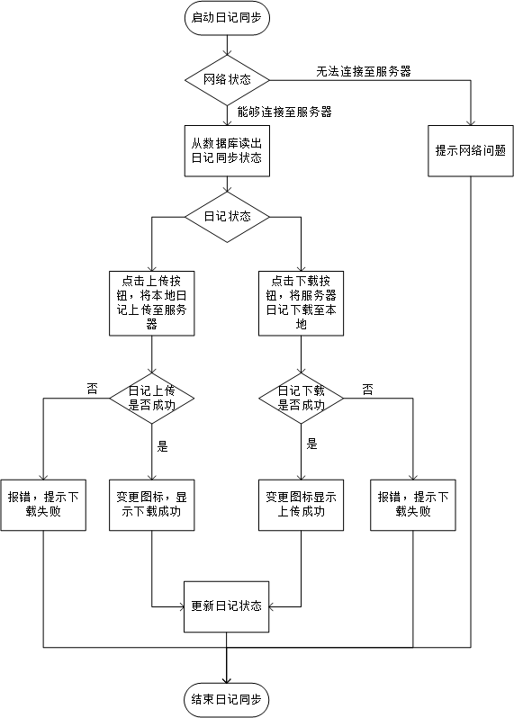
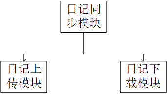

概要设计说明书
====
## 引言：
>编写目的：
本阶段是在系统的需求分析的基础上，对电子日记本系统做的概要分析。主要解决实现该系统需求的模块设计额外难题，包括把该系统划分为哪些模块，决定各个模块之间的接口，模块之间传递的信息等

>在下一阶段的详细设计中，设计人员可参考此概要设计说明书，在概要设计对电子日记本系统所做的模块结构的基础上，对系统进行详细设计，在以后的软件测试以及软件维护阶段也可参考此说明书，以便了解在概要设计过程中完成的各个模块设计结构，或在修改时找出在本阶段设计的不足和错误

1.2项目背景

1.3 定义

1.3.1专业术语

1.4参考资料

1.5

二、总体设计

2.1 需求规定

2.1.1 系统功能

本系统主要包括以下几个方面的功能：

>本地日记上传到云端

>云端日记下载至本地

系统性能
>时间特性要求：与具体的网络状况有关

>可靠性：在常规情况下，不能出现日记上传或下载是产生乱码等内容错误，不能在上传和下载中丢失日记。

输入输出要求
>满足用户上传日记到云端的需求和从云端下载日记到本地的需求

数据管理能力要求：
>采用mysql 5.7数据库进行数据管理，在系统出现故障后，能够对数据库进行恢复

故障处理要求
>要求在用户上传或下载失败、网咯错误以及其他错误时时，能够给用户提示，在系统出现错误时，要保证数据的一致性，确保用户日记在本地和云端的保存状态正确；

运行环境：
>2.2.1 设备：

>Android 6.0 以上的智能手机，可靠的网络连接

接口
>本模块提供用户单个日记的上传和下载接口,外部系统可通过这两个接口上传本地日记到云端，下载云端日记到本地

基本设计概念和处理流程

各个模块的说明如下：

三．接口设计

3.1 人机交互接口
>根据日记状态在固定位置显示不同按钮

>点按列表日记对应上传按钮，触发日记上传事件，上传日记

>点按列表日记对应下载按钮，触发日记下载事件，上传下载日记

3.2 网络接口

>需要其他系统提供网络状态检查接口。

3.3 系统和外部接口

3.4 系统内模块之间接口

3.5 数据库接口
>在日记上传和下载时需要数据库系统提供日记文件位置的查看及日记状态的查看及修改。

四．系统数据结构设计

4.1 逻辑结构设计要点

数据库的结构见下表：

>需要在日记表里添加如下一个字段记录日记状态。

|属性 |	数据类型 |主键	|外键	|可否为空|	说明
|-------|
|status|	Integer(2)|	|	|	N|本地存在副本云端不存在为状态0，云端存在副本本地不存在副本为状态1，云端本地均存在副本且副本不一致为状态3，云端本地均存在副本且副本不致为状态4

五．系统出错处理设计

5.1 出错信息

>当出现网络连接错误时，采用的处理方式为向用户返回网络连接错误，显示相应的错误信息

>当出现上传失败错误时，采用的处理方式为向用户返回上传失败错误，显示相应的错误信息

>当出现下载失败错误时，采用的处理方式为向用户返回下载失败错误，显示相应的错误信息

>当出现系统级错误时，采取的处理方式为向用户返回错误信息，具体为：“对不起，无法完成同步！”

5.2 补救措施

>数据库的备份采取每段时间进行一次完全备份，并采取带日志运行的方式当出现数据库级的错误时，采取的方式分为两种：

>用数据库的完全备份实现数据库的完全恢复

>用数据库的完全备份和日志文件实现数据库的不完全恢复
