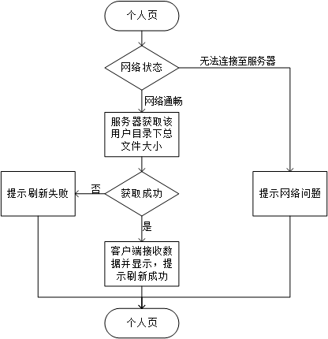

概要设计说明书
====
## 引言：
>编写目的：
本阶段是在系统的需求分析的基础上，对电子日记本系统做的概要分析。主要解决实现该系统需求的模块设计额外难题，包括把该系统划分为哪些模块，决定各个模块之间的接口，模块之间传递的信息等

>在下一阶段的详细设计中，设计人员可参考此概要设计说明书，在概要设计对电子日记本系统所做的模块结构的基础上，对系统进行详细设计，在以后的软件测试以及软件维护阶段也可参考此说明书，以便了解在概要设计过程中完成的各个模块设计结构，或在修改时找出在本阶段设计的不足和错误

1.2项目背景

1.3 定义

1.3.1专业术语

1.4参考资料

1.5

二、总体设计

2.1 需求规定

2.1.1 系统功能

本系统主要包括以下几个方面的功能：

>本地日记上传到云端

>云端日记下载至本地

系统性能
>时间特性要求：与具体的网络状况有关

>可靠性：在常规情况下，不能出现日记上传或下载是产生乱码等内容错误，不能再上传和下载中丢失日记

输入输出要求

数据管理能力要求：
采用mysql 5.7数据库进行数据管理，在系统出现故障后，能够对数据库进行恢复

故障处理要求
>要求在用户上传或下载失败、网咯错误以及其他错误时时，能够给用户提示，在系统出现错误时，要保证数据的一致性，确保用户日记在本地和云端的保存状态正确；

运行环境：
>2.2.1 设备：

>Android 6.0 以上的智能手机，可靠的网络连接

接口
>本模块提供用户单个日记的上传和下载接口

基本设计概念和处理流程

各个模块的说明如下：

三．接口设计

3.1 人机交互接口
>在用户个人信息界面显示已使用储存空间大小

>点击刷新按钮实时刷新最新占用存储空间大小

>点按列表日记对应下载按钮，触发日记下载事件，上传下载日记

3.2 网络接口

>需要其他系统提供网络状态检查接口。

3.3 系统和外部接口

3.4 系统内模块之间接口

3.5 数据库接口
>需要从数据库获取用户已占用空间大小

四．系统数据结构设计

4.1 逻辑结构设计要点

数据库的结构见下表：

>需要在用户表里添加如下一个字段已记录已占用空间，方便查看

|属性 |	数据类型 |主键	|外键	|可否为空|	说明
|-------|
|fileSize|	Integer(20) |	|	|	N|用户占用空间大小，以KB为单位|

五．系统出错处理设计

5.1 出错信息

>当出现网络连接错误时，采用的处理方式为向用户返回网络连接错误，显示相应的错误信息

>当出现系统级错误时，采取的处理方式为向用户返回错误信息，具体为：“对不起，无法获取数据！”

5.2 补救措施

>数据库的备份采取每段时间进行一次完全备份，并采取带日志运行的方式当出现数据库级的错误时，采取的方式分为两种：

>用数据库的完全备份实现数据库的完全恢复

>用数据库的完全备份和日志文件实现数据库的不完全恢复
