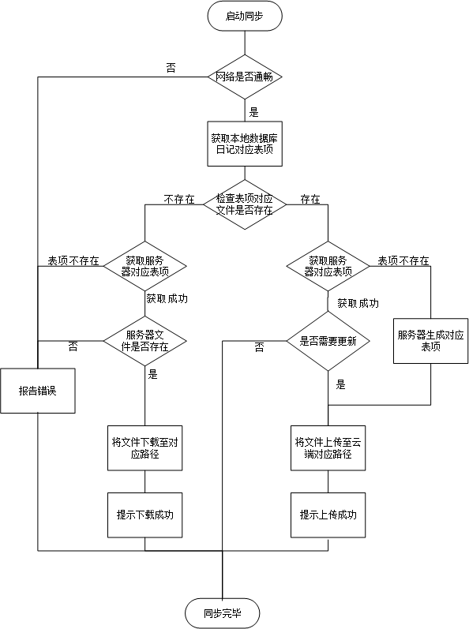

详细设计说明书
====

#### 1. 输入输出项

|子模块|输入|输出|
|:---:|:---:|:---:|
|日记上传|一个待上传日记数据库表项的model|上传结果|
|日记下载|一个待下载日记数据库表项的model|下载结果|

###### 日记上传

输入项

|名称|标识符|类型|介质|来源|描述|
|:---:|:---:|:---:|:---:|:---:|:---:|:---:|:---:|
|||||||
输出项

|名称|标识符|类型|介质|来源|描述|
|:---:|:---:|:---:|:---:|:---:|:---:|:---:|:---:|
|||||||

###### 日记下载

输入项

|名称|标识符|类型|介质|来源|描述|
|:---:|:---:|:---:|:---:|:---:|:---:|:---:|:---:|
|||||||

输出项

|名称|标识符|类型|介质|来源|描述|
|:---:|:---:|:---:|:---:|:---:|:---:|:---:|:---:|
|||||||

#### 2. 设计方法（算法）
>利用日记ID查询数据库获得路径字段以查找对应的文件，将文件上传至服务器对应的路径,或将服务
器对应路径的文件下载至本地对应路径。

#### 3. 接口

  |DiarySyncTool|
  |:---:|
  ||
  |+diaryUploader(Integer id):String +diaryDownloader(Integer id):String|

#### 4. 流程逻辑

#### 5. 存储分配

#### 6. 注释设计
在本程序中安排的注释，如：

>a.  加在模块首部的注释；

>b.  加在各分枝点处的注释；

>c．  对各变量的功能、范围、缺省条件等所加的注释；

>d．  对使用的逻辑所加的注释等等。

#### 7. 限制条件

#### 8. 测试计划
